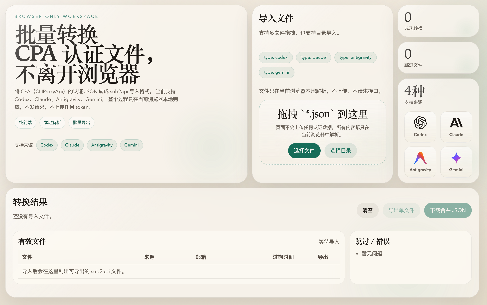

# CPA to sub2api

纯前端网页工具，用来把 CPA（CLIProxyApi）的认证文件转换成 sub2api 可导入的 JSON。

## 界面预览



## 在线使用

### [**》》 点我直接使用 《《**](https://gtxx3600.github.io/CPA2sub2API/)

## 特性

- 浏览器本地完成解析和转换，不调用任何接口
- 支持拖拽多个 `*.json` 文件
- 支持目录导入
- 支持 `codex`、`claude`、`antigravity`、`gemini`
- 可导出相同数量的单文件结果
- 可下载一个合并后的 sub2api 文件

## 转换约定

- CPA 中拿不到的字段直接省略
- 导出的每个 `account` 默认包含：
  - `concurrency: 10`
  - `priority: 1`

## 仓库结构

- `docs/index.html`: 页面入口
- `docs/styles.css`: 页面样式
- `docs/src/app.mjs`: 页面交互和导出逻辑
- `docs/src/converter.mjs`: CPA 到 sub2api 的转换逻辑
- `docs/.nojekyll`: GitHub Pages 静态部署辅助文件

## 本地预览

直接打开 `docs/index.html` 即可使用。

如果你想用更稳定的本地静态服务，可以执行：

```bash
cd docs
python3 -m http.server 8000
```

然后访问 `http://localhost:8000`
